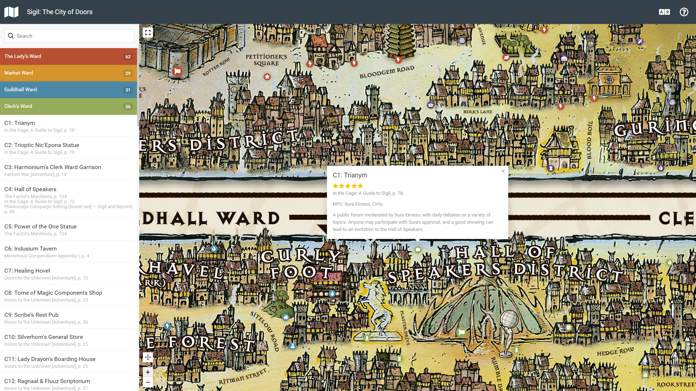

# The Map of Sigil, City of Doors

This map descends from two well-known planewalker.com downloads: hi-res [PDF map of Sigil](http://mimir.planewalker.com/sites/default/files/Sigil_Map2.pdf) and [Sigil Venues spreadsheet](http://mimir.planewalker.com/sites/default/files/Sigil%20Venues2.xls), a compilation of all named venues culled from official Planescape material.

It lists basic information about each location, wherever available, and is primarily intended to serve as a reference index rather than a substitute for the various products in which these venues appear.

[Map translations are managed via Crowdin](https://crowdin.com/project/map-of-sigil).  
Feel free to join (and let me know if your language is not in the list yet).

## Locations

There are currently 308 Sigil venues in the list, but only 289 map pins (some venues like The Secret Door simply don’t have a constant location). Data have been culled from a variety of sources including most official 2e supplements, adventures and even setting specific novels and a video game.

To be included in this compilation a location needs to have a proper name or unique moniker, be located in Sigil (or at least have its primary access point in Sigil) and serve some type of identifiable function (be it public or private).

Places of business are usually followed by a qualifier which identifies the type of establishment it is (for example: inn, tavern, etc).

The vast majority of these venues find their origins in 2e AD&D sources which predate the events described in the Faction War adventure. Many are also culled from adventures and supplements with no clear mention of when in the city’s history these venues came into being or later became defunct; leaving dubious timeline issues and the fates of some of the locations for individual DMs to resolve.

Some venues, in their original context, have only dubious mentions concerning their placement within the city’s wards while others offer no such clues. In other circumstances some of the venues have two or more sources which contradict each other in regards to location. Although individual DMs are free to place such venues in whichever ward suits their own tastes and story needs, for the purpose of creating the accompanying Sigil Map, it was necessary to ascribe each venue a definitive position within the city’s six wards. In such circumstances a subjective decision was made based on the available background material and the resultant entry is *marked in red*.

Venues without an exact location are greyed-out in the list.

Since Sigil is described as being morphic in nature, both growing and shrinking at the Lady’s whim with both buildings and streets being moved by the Dabus over time, the map is intended to represent only one possible geographic configuration of the city with approximate distances. Scale of the features on the map is only representational, meaning that individual buildings are purposefully enlarged to depict appearance and importance rather than relative scale to each other.

## Rating

Star rating is a subjective evaluation of how completely the venue is described in the source material.

A **single star** indicates that the source material contains little to no information beyond what is included in the list.

**Two stars** indicate that the source material contains a few additional background details beyond what is included in the list.

**Three stars** indicate that there is significant background information available in the source material concerning the venue, possibly including some significant background information.

**Four stars** indicate that the venue is described in great detail with most of the pertinent information a DM might like to know, usually including a map.

**Five stars** are reserved for fully fleshed-out venues, usually including maps, key NPC stats, extensive background information and possibly even artwork.

## References

Some venues are listed with multiple pages and multiple sources if significant information is available elsewhere but, in most instances, only a venue’s primary or best available source material is referenced.

Below is the full list of Planescape material used to make up this map:

1. Planes of Conflict [Boxed Set] — Adventures in Conflict
1. Baldur’s Gate II [PC Game]
1. Wars Trilogy 1: Blood Hostages [Novel]
1. Blood Wars Trilogy 2: Abyssal Warriors [Novel]
1. Blood Wars Trilogy 3: Planar Powers [Novel]
1. Planes of Chaos [Boxed Set] — Chaos Adventures
1. Dead Gods [Adventure]
1. Planescape Campaign Setting [Boxed Set] — A DM Guide to the Planes
1. Dragon Magazine
1. The Deva Spark [Adventure]
1. Doors to the Unknown [Adventure]
1. Dungeon Magazine
1. Die Vecna Die! [Adventure]
1. The Eternal Boundary [Adventure]
1. Expedition to the Demonweb Pits [Adventure]
1. Finder’s Bane [Novel]
1. Fires of Dis [Adventure]
1. Faces of Evil: The Fiends
1. The Factol’s Manifesto
1. Faction War [Adventure]
1. A Guide to the Astral Plane
1. A Guide to the Ethereal Plane
1. The Great Modron March [Adventure]
1. Hellbound: The Blood War [Boxed Set] — The Chant of the War
1. Hellbound: The Blood War [Boxed Set] — The Dark of the War
1. Harbinger House [Adventure]
1. Hellbound: The Blood War [Boxed Set] — War Games
1. The Inner Planes
1. In the Abyss [Adventure]
1. In the Cage: A Guide to Sigil
1. Planes of Conflict [Boxed Set] — Liber Benevolentiae
1. Planes of Conflict [Boxed Set] — Liber Malevolentiae
1. Monstrous Compendium Appendix
1. Monstrous Compendium Appendix II
1. Monstrous Compendium Appendix III
1. On Hallowed Ground
1. Planescape Conspectus [Poster]
1. Planes of Chaos [Boxed Set] — the Travelogue
1. Planescape Campaign Setting [Boxed Set] — A Player’s Guide to the Planes
1. The Planeswalker’s Handbook
1. Planar Handbook
1. Planes of Law [Boxed Set] — Arcadia
1. Planes of Law [Boxed Set] — Baator
1. Planes of Law [Boxed Set] — Mount Celestia
1. Polyhedron Magazine
1. Pages of Pain [Novel]
1. Planescape: Torment [PC Game]
1. Planescape: Torment [Novel]
1. Planescape Campaign Setting [Boxed Set] — Sigil and Beyond
1. Something Wild [Adventure]
1. Tales From the Infinite Staircase [Adventure]
1. Tymora’s Luck [Novel]
1. Uncaged: Faces of Sigil
1. Well of Worlds [Adventure]

## Credits

Montage: Denis “Ambrus” Richard.  
Original cartography: Rob Lazzaretti.  
Additional artwork: Tony DiTerlizzi &amp; David S. “Diesel” LaForce.  
Poetry: [Dolores](http://rpo.library.utoronto.ca/poems/dolores-notre-dame-des-sept-douleurs) by Algernon Charles Swinburne.  

Map engine: [Mapplic](https://codecanyon.net/item/mapplic-custom-interactive-map-jquery-plugin/6275001) by sekler.

## License

[The map data](source/data/) (i.e. the annotated list of Sigil venues), as well as the project documentation, are licensed under the [Creative Commons Attribution 4.0 International](https://creativecommons.org/licenses/by/4.0/) license (CC BY 4.0).

The underlying source code used to format and display that content is licensed under the [MIT](https://opensource.org/licenses/mit-license.php) license, with an exception of [third-party components](source/vendor/).  

Although in most cases these components have the same license, there may be other options.
